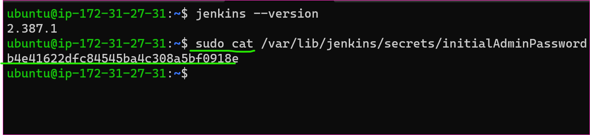
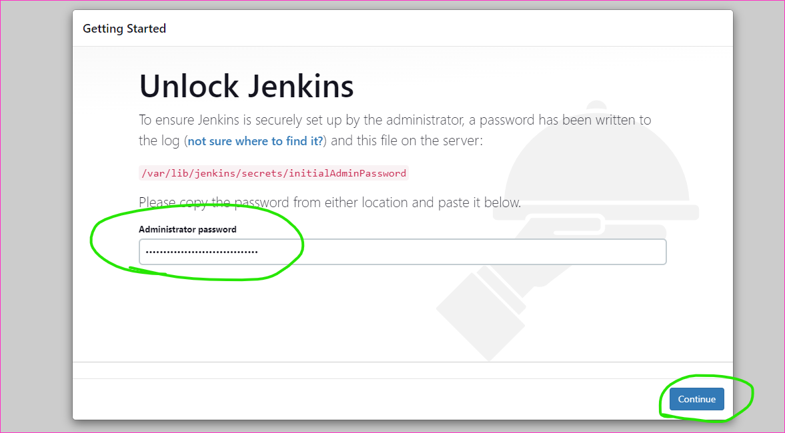
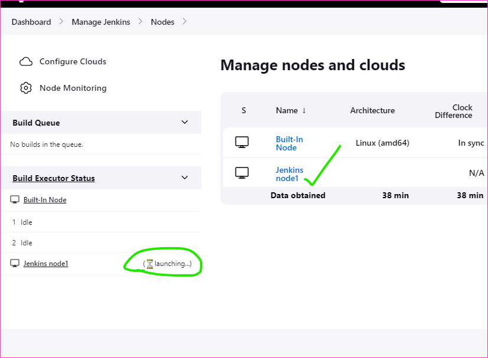

To Deploy the Spring Petclinic Project
-----------------------------
* We can Create one Instance with t2.micro 

* Connect to machine with gitbash terminal
[refer here](https://www.jenkins.io/doc/book/installing/linux/#long-term-support-release) for the official docs of Installing Jenkins on ubuntu
* To run the below commands in machine
```
sudo apt update
curl -fsSL https://pkg.jenkins.io/debian-stable/jenkins.io.key | sudo tee \
  /usr/share/keyrings/jenkins-keyring.asc > /dev/null
echo deb [signed-by=/usr/share/keyrings/jenkins-keyring.asc] \
  https://pkg.jenkins.io/debian-stable binary/ | sudo tee \
  /etc/apt/sources.list.d/jenkins.list > /dev/null
sudo apt install openjdk-8-jdk openjdk-17-jdk maven -y
sudo apt update
sudo apt install jenkins -y  
```






* We can take some sample project in jenkins master spring petclinic for freestyle project
[refer here](https://github.com/qtrajkumarmarch23/spring-petclinic) for the sample application of spring petclinic github repository


![preview]
![preview]
![preview]
![preview]
![preview]
![preview]
![preview]
![preview]
![preview]
![preview]
* For Node in Jenkins we need to add one more node name called Jenkins Node 1 with t2.medium, because we can run spring petclinic project that's why we need to take 2 Vpc's and 2 Gib's of RAM

```
sudo apt update
sudo apt install openjdk-8-jdk openjdk-17-jdk maven -y
mvn --version
```

* To add jenkins node 1 to jenkins controller


* For the known host we need to do some configurations in Jenkins controller.
* To go to terminal and login into Jenkins controller
```
sftp -i ~\Downloads\jenkins.pem ubuntu@172.31.0.228
put jenkins.pem
bye
ssh -i ~\Downloads\jenkins.pem ubuntu@172.31.0.228
ls
sudo -i
ls -al jenkins.pem
cp jenkins.pem /tmp/
cd /tmp
chown jenkins:jenkins jenkins.pem
ls -al jenkins.pem
chmod 400 jenkins.pem
su jenkins
ssh -i /tmp/jenkins.pem ubuntu@172.31.0.228(private add of jenkins node)
exit
ls ~/.ssh
```



* Start the spring petclinic jenkinsfile for basic steps
[refer here](https://github.com/qtrajkumarmarch23/spring-petclinic/commit/759cd49a1134904840abae22bffd40c425f154ef) for the basic jenkinsfile.


![preview]
![preview]
![preview]
![preview]
![preview]
![preview]
![preview]
![preview]

![preview]
![preview]
![preview]

![preview]
![preview]